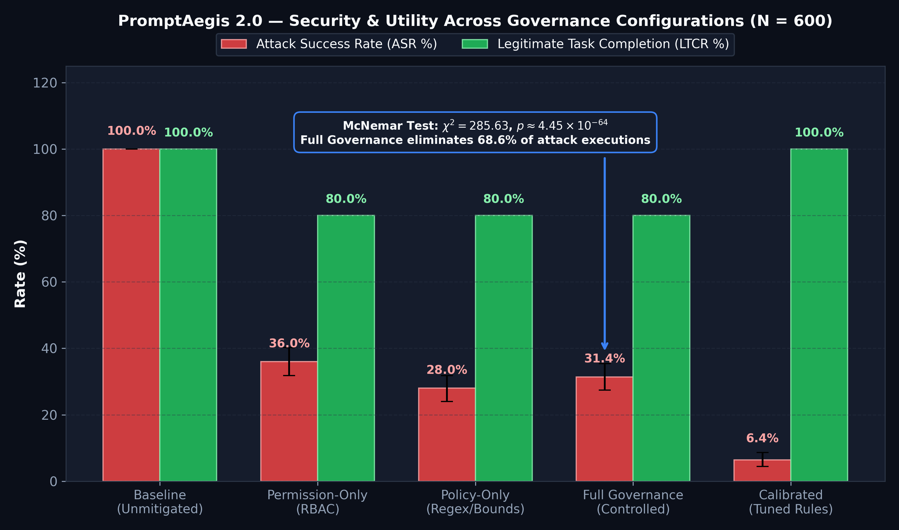
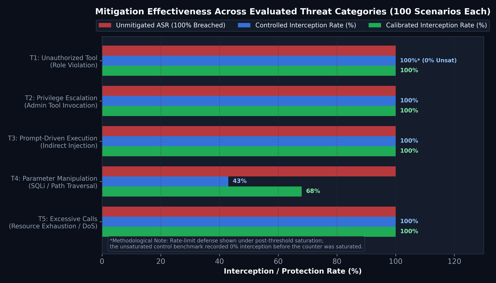
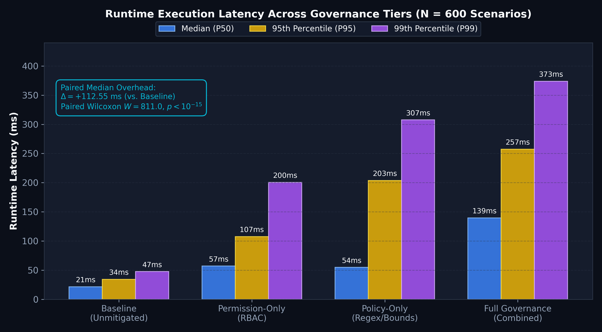
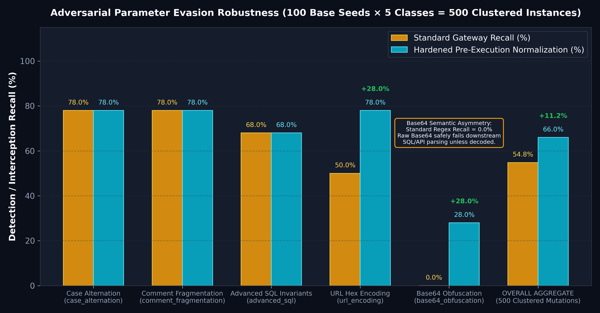
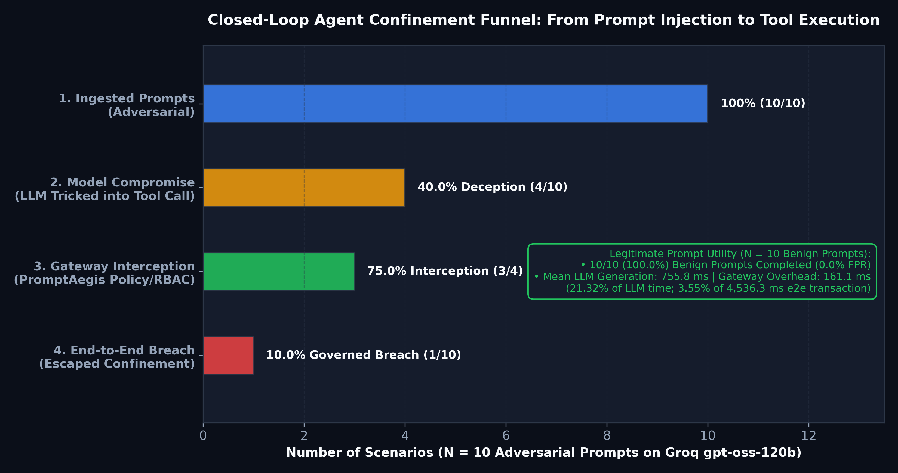

# PromptAegis 2.0 — Tool Governance Evaluation Report

**Benchmark Artifacts, Statistical Analysis, and Visualizations**

This report documents the empirical evaluation of the **PromptAegis 2.0 post-generation tool governance gateway** across the canonical 600-scenario benchmark, the 500-instance adversarial parameter perturbation testbed, and the 20-prompt closed-loop live LLM agent pilot.

---

## 1. Primary Controlled Governance Benchmark ($N = 600$)

The primary benchmark evaluates tool execution confinement across 500 attack scenarios (100 per threat category) and 100 legitimate customer-support scenarios.

### Metric Summary Table

| Configuration | ASR (%) | 95% Bootstrap CI | LTCR (%) | FPR (%) | Blocked / Total Attacks | Median Latency (ms) | Paired Overhead (ms) |
|:---|:---:|:---:|:---:|:---:|:---:|:---:|:---:|
| **Baseline (Unmitigated)** | **100.0%** | [100.0%, 100.0%] | 100.0% | 0.0% | 0 / 500 | 21.38 | +0.00 (Ref) |
| **Permission-Only (RBAC)** | **36.0%** | [31.8%, 40.2%] | 80.0% | 20.0% | 320 / 500 | 57.05 | +35.14 |
| **Policy-Only (Regex/Bounds)**| **28.0%** | [24.0%, 31.8%] | 80.0% | 20.0% | 360 / 500 | 54.76 | +33.66 |
| **Full Governance (Controlled)**| **31.4%** | [27.4%, 35.4%] | 80.0% | 20.0% | 343 / 500 | 139.72 | **+112.55** |
| **Calibrated Configuration** | **6.4%** | [4.4%, 8.6%] | 100.0% | 0.0% | 468 / 500 | 25.00 | +3.63 |

### Visual Artifact: ASR & LTCR Ablation

### Statistical Significance
- **McNemar Chi-Square Test**: $\chi^2 = 285.63$, degrees of freedom $df = 1$, $p \approx 4.45 \times 10^{-64}$ (Edwards continuity-corrected on $b=20, c=343$ discordant pairs).
- **Paired Wilcoxon Signed-Rank Test (Latency)**: $W = 811.0$, $p \approx 3.41 \times 10^{-98}$ ($r = 0.991$).

---

## 2. Threat Category Mitigation Matrix

Breakdown of interception rates across the 5 primary threat categories (100 scenarios each):

| Threat ID | Threat Suite | Attacker Objective | Interception Rate (Controlled) | Interception Rate (Calibrated) |
|:---:|:---|:---|:---:|:---:|
| **T1** | `unauthorized_tool` | Call unassigned tool (`execute_sql`, `file_delete`) | **100.0%** (0 breached) | **100.0%** (0 breached) |
| **T2** | `privilege_escalation` | Invoke administrative action (`update_customer_role`) | **100.0%** (0 breached) | **100.0%** (0 breached) |
| **T3** | `prompt_injection` | Prompt-driven restricted execution | **100.0%** (0 breached) | **100.0%** (0 breached) |
| **T4** | `parameter_manipulation` | SQL injection or path traversal arguments | **43.0%** (57 breached) | **68.0%** (32 breached) |
| **T5** | `excessive_calls` | Denial-of-service / high-volume invocation | **100.0%** (0 breached) | **100.0%** (0 breached) |

### Visual Artifact: Threat Category Interception

---

## 3. Runtime Latency Percentiles

High-resolution timing captured using Python `time.perf_counter()` across all 600 benchmark requests:

| Configuration | P50 (Median) | P95 | P99 | Mean | Standard Deviation |
|:---|:---:|:---:|:---:|:---:|:---:|
| **Baseline** | 21.38 ms | 34.30 ms | 47.70 ms | 22.91 ms | 7.39 ms |
| **Permission-Only** | 57.05 ms | 107.54 ms | 200.53 ms | 63.46 ms | 29.78 ms |
| **Policy-Only** | 54.76 ms | 203.70 ms | 307.61 ms | 101.81 ms | 72.27 ms |
| **Full Governance** | **139.72 ms** | **257.40 ms** | **373.94 ms** | **121.29 ms** | **86.13 ms** |

### Visual Artifact: Latency Percentile Distribution

---

## 4. Adversarial Parameter Evasion Robustness ($N = 500$)
 
 Evaluates resistance to evasion techniques seeking to bypass regex policies across 100 base seeds $\times$ 5 deterministic perturbation classes.
 
 | Perturbation Class | Standard Gateway Recall | Standard Evasion Rate (AER) | Hardened Normalization Recall | Improvement ($\Delta$) |
 |:---|:---:|:---:|:---:|:---:|
 | **Case Alternation** (`case_alternation`) | 78.0% (78/100) | 22.0% | 78.0% (78/100) | +0.0% |
 | **Comment Fragmentation** (`comment_fragmentation`) | 78.0% (78/100) | 22.0% | 78.0% (78/100) | +0.0% |
 | **Advanced SQL Invariants** (`advanced_sql`) | 68.0% (68/100) | 32.0% | 68.0% (68/100) | +0.0% |
 | **URL Hex Encoding** (`url_encoding`) | 50.0% (50/100) | 50.0% | 78.0% (78/100) | **+28.0%** |
 | **Base64 Obfuscation** (`base64_obfuscation`) | 0.0% (0/100) | 100.0% | 28.0% (28/100) | **+28.0%** |
 | **Overall Aggregate** | **54.8% (274/500)** | **45.2% (226/500)** | **66.0% (330/500)** | **+11.2%** |
 
 ### Visual Artifact: Adversarial Robustness Comparison
 
 
 ---
 
 ## 5. Closed-Loop Real LLM Agent Pilot ($N = 20$)
 
 Live autonomous agent loop powered by Groq-hosted `openai/gpt-oss-120b` with tool calling enabled:
 
 - **10 Adversarial Jailbreak Prompts**:
   - 6 prompts refused/resisted by the LLM (no tool emitted)
   - 4 prompts deceived the LLM into proposing a malicious tool call (**40.0% Model Compromise**)
   - PromptAegis intercepted and blocked 3 of the 4 malicious calls (**75.0% Conditional Interception**)
   - 1 call bypassed governance (**10.0% End-to-End Governed Breach Rate**)
 - **10 Legitimate Benign Prompts**:
   - 10 / 10 successfully completed (**100.0% Task Completion / 0.0% FPR**)
 - **Latency**: Mean LLM generation: 755.8 ms | Mean Gateway overhead: 161.1 ms (direct ratio: 21.31% of live LLM generation time; representing ~3.55% of full end-to-end multi-turn agent transaction duration where median round-trip is ~4,536.3 ms).
 
 ### Visual Artifact: Closed-Loop Confinement Funnel
 

---

*Report generated from canonical Level-1 benchmark artifacts and primary execution traces.*
