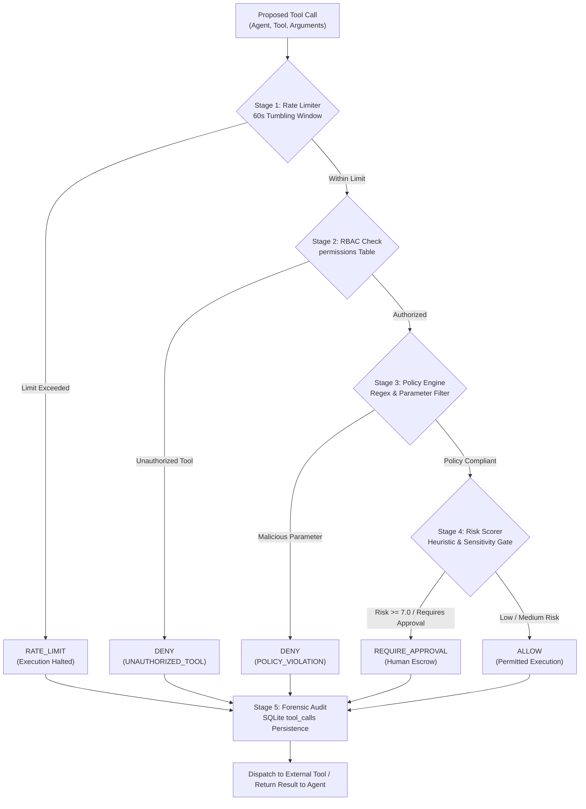

# PromptAegis

**Deterministic Post-Generation Tool Governance Gateway for Autonomous AI Agents**

[](https://www.python.org/downloads/)
[](https://fastapi.tiangolo.com)
[](https://react.dev/)
[](https://vitejs.dev/)
[](https://docs.docker.com/compose/)
[](#security-disclosure)

---

## Navigation

- [Overview and Conceptual Framing](#overview-and-conceptual-framing)
- [The Fundamental Problem](#the-fundamental-problem)
- [Why PromptAegis: Decoupled Confinement](#why-promptaegis-decoupled-confinement)
- [System Architecture](#system-architecture)
- [Threat Model](#threat-model)
- [Key Security Mechanisms](#key-security-mechanisms)
- [Empirical Research Results](#empirical-research-results)
- [Adversarial Robustness Evaluation](#adversarial-robustness-evaluation)
- [Closed-Loop Live LLM Agent Pilot](#closed-loop-live-llm-agent-pilot)
- [Results Interpretation and Scientific Scope](#results-interpretation-and-scientific-scope)
- [Threats to Validity and Limitations](#threats-to-validity-and-limitations)
- [Quick Start](#quick-start)
- [Project Directory Structure](#project-directory-structure)
- [Reproducing the Research](#reproducing-the-research)
- [Engineering vs. Research Contributions](#engineering-vs-research-contributions)
- [Evidence Hierarchy and Traceability](#evidence-hierarchy-and-traceability)
- [Citation and Security Disclosure](#citation-and-security-disclosure)

---

## Overview and Conceptual Framing

**PromptAegis** is an application-level, post-generation execution confinement gateway designed to govern tool invocations issued by autonomous AI agents. Rather than attempting to solve prompt injection through probabilistic text classifiers or fragile prompt engineering at the input layer, PromptAegis intercepts **structured tool call requests after model generation** but **prior to crossing into external system APIs or downstream execution environments**.

```
PROMPT INJECTION ATTACK (Direct or Indirect)
                     │
                     ▼
             LLM / AGENT REASONING
                     │
                     ▼
          PROPOSED TOOL INVOCATION
       {"tool": "execute_sql", ...}
                     │
                     ▼
  ┌─────────────────────────────────────┐
  │         PROMPTAEGIS GATEWAY         │
  │                                     │
  │  [1] Rate Limiter (60s Window)      │
  │  [2] Role-Based Access Control      │
  │  [3] Policy & Parameter Validation  │
  │  [4] Risk & Severity Scoring        │
  │  [5] Forensic Execution Audit       │
  └─────────────────────────────────────┘
                     │
                     ▼
     [ ALLOW | REQUIRE_APPROVAL | DENY ]
                     │
         ┌───────────┴───────────┐
         ▼                       ▼
   EXTERNAL API            BLOCKED AT
(Database / Shell)          BOUNDARY
```

### What PromptAegis Is
- **An Execution Confinement Gateway**: An intermediary enforcement layer that evaluates candidate tool calls against deterministic security invariants (RBAC, regex parameter constraints, rate limits, and approval policies).
- **A Decoupled Security Boundary**: An architecture ensuring that an agent's internal cognitive compromise does not automatically translate into unauthorized execution privilege.
- **An Auditable Governance Platform**: A full-stack system providing real-time interception, policy authoring, automated benchmark reproduction, and cryptographic forensic execution tracing.

### What PromptAegis Is NOT
- **Not a Universal Prompt Injection Detector**: It does not inspect raw natural language inputs to decide whether a user prompt is semantically hostile.
- **Not a Guarantee of Complete Immunity**: If an authorized tool is invoked with syntactically valid parameters that still accomplish an attacker's subtle semantic objective, PromptAegis will permit the execution.
- **Not an Out-of-Band Sandbox**: Confinement is contingent upon agent tool execution being routed through the gateway adapter. Out-of-band execution paths that circumvent the gateway are outside its reference monitor boundary.
- **Not a Replacement for Model Alignment or System Defense-in-Depth**: It complements, rather than supplants, secure coding practices, least-privilege database accounts, and operating system virtualization.

---

## The Fundamental Problem

Modern LLM-based autonomous agents do not merely generate text—they interact with operating systems, query production databases, call external APIs, and execute arbitrary code. Consequently:

$$\text{Prompt-Level Safety} \neq \text{Execution-Level Safety}$$

1. **The Fallacy of Input-Layer Detection**: Statistical classifiers, heuristic filters, and LLM-as-a-judge pre-guards operate on unstructured natural language. Attackers systematically evade them using lexical perturbations, multi-turn context dilution, linguistic indirection, and base64/URL encoding.
2. **The Fragility of System Prompts**: Instructing an LLM to "never delete production databases" fails under adversarial pressure because instruction-following models cannot mathematically distinguish authoritative system instructions from untrusted data inputs.
3. **The Disconnect**: When an agent ingests untrusted third-party data (e.g., summarizing an email or reading a webpage containing an indirect injection), the model may become fully subverted. If the agent holds unmediated credentials, the attacker inherits full ambient execution authority.

---

## Why PromptAegis: Decoupled Confinement

PromptAegis addresses this vulnerability by shifting the primary enforcement locus from **pre-generation prompt filtering** to **post-generation execution governance**.

### Architecture Comparison

```
UNMITIGATED AGENT PIPELINE:
User / Attacker ──► Ingestion ──► LLM / Agent ──► Tool Call ──► External Execution
                                  (Subverted)                   (Compromised System)

GOVERNED PROMPTAEGIS PIPELINE:
User / Attacker ──► Ingestion ──► LLM / Agent ──► Proposed Call ──► [ PROMPTAEGIS ] ──► ALLOW ──► External Execution
                                  (Subverted)                        │
                                                                     ├─► REQUIRE_APPROVAL ──► Human-in-the-Loop
                                                                     └─► DENY / RATE_LIMIT ──► Boundary Confined
```

### Core Architectural Axiom
> **Security enforcement must be decoupled from model generation.** The agent proposes candidate actions; a deterministic reference monitor decides whether those actions are permitted to cross the trust boundary.

---

## System Architecture

PromptAegis consists of a high-throughput FastAPI asynchronous backend, a thread-safe relational database management system, an agent runtime adapter layer, and an interactive React 18 administrative dashboard.

### Gateway Pipeline Flow



### Implementation Module Reference

| Component / Subsystem | Repository Source File | Core Responsibility |
|:---|:---|:---|
| **Interception Pipeline** | `backend/governance/interceptor.py` | Orchestrates the multi-stage evaluation pipeline; enforces deterministic decision hierarchy (`RATE_LIMIT` → `POLICY_DENY` → `RBAC_DENY` → `RISK_GATE` → `ALLOW`). |
| **RBAC Engine** | `backend/governance/permission_engine.py` | Validates agent identity against authorized tool mappings stored in the relational database. |
| **Policy Engine** | `backend/governance/policy_engine.py` | Enforces parameter-level regex patterns, forbidden commands, path traversal filters, and payload size bounds. |
| **Rate Limiter** | `backend/governance/rate_limiter.py` | Implements a 60-second sliding tumbling window (`math.floor(ts / 60.0) * 60.0`) tracking invocations per `(agent_id, tool_name)`. |
| **Risk Scorer** | `backend/governance/risk_scorer.py` | Evaluates tool criticality, destructive side-effects, and parameter sensitivity; gates execution when threat score $\ge 7.0$. |
| **Agent SDK & Adapter** | `backend/governance/adapter.py` | Standardizes agent tool calls via `StandardToolRequest` (PRD §12.1); provides `@wrap_tool` Python function decorator. |
| **Database & Audit** | `backend/database/db.py` | Thread-safe SQLite context manager managing 9 relational tables; logs immutable forensic traces for every intercepted call. |
| **Experiments API** | `backend/api/experiments.py` | Programmatic benchmark orchestration engine supporting automated reproduction, configuration ablations, and CSV export. |
| **Governance API** | `backend/api/governance.py` | REST endpoints for agent registration, tool provisioning, RBAC assignment, policy management, and statistics. |
| **Administrative UI** | `frontend/src/` | React 18 single-page application featuring interactive policy panels, real-time interceptor logs, and benchmark runners. |

---

## Threat Model

PromptAegis is evaluated against an adversarial threat model spanning six primary tool-misuse vectors.

| Threat ID | Threat Category | Attacker Capability | Attack Vector & Manifestation | Gateway Mitigation Control | Primary Benchmark Outcome |
|:---:|:---|:---|:---|:---|:---:|
| **T1** | **Unauthorized Tool Use** | Attacker injects prompt forcing agent to call unassigned tools. | Agent assigned `support` role invokes `execute_sql` or `file_delete`. | Strict RBAC permission lookup in `permissions` table. | **100% Interception** (0/100 attacks breached) |
| **T2** | **Privilege Escalation** | Attacker manipulates agent into performing administrative mutations. | Support agent attempts to invoke `export_customer_data` or `update_customer_role`. | Role-to-tool permission constraints and administrative policy barriers. | **100% Interception** (0/100 attacks breached) |
| **T3** | **Prompt-Driven Restricted Tool Execution** | Attacker embeds indirect jailbreak within retrieved context. | Agent is instructed to bypass conversational boundaries and invoke high-risk APIs. | Combined RBAC verification, tool risk gating, and parameter validation. | **100% Interception** (0/100 attacks breached) |
| **T4** | **Parameter Manipulation** | Attacker exploits an authorized tool by injecting malicious arguments. | Agent calls authorized `search_customer`, but argument contains `admin'; DROP TABLE customers;--` or `../../etc/passwd`. | Fine-grained parameter regex filters and path traversal detection rules. | **43% Interception** (Controlled benchmark baseline policies; improved to 68% under calibrated rules) |
| **T5** | **Excessive Invocations (DoS)** | Attacker forces recursive or loops of resource-intensive tool calls. | Prompt induces rapid automated search queries exhaustively scraping records. | 60-second tumbling-window rate counter stored in SQLite. | **100% Interception** (0/100 attacks breached once saturated) |
| **T6** | **Adversarial Parameter Obfuscation** | Attacker perturbs malicious payloads to evade syntactic regex filters. | Payloads perturbed using case alternation, comment fragmentation, advanced SQL syntax, URL hex encoding, or Base64 obfuscation. | Evaluated under standard regex vs hardened pre-execution normalization layers. | **54.8% Recall** (Standard) → **66.0% Recall** (Hardened normalization) |

---

## Key Security Mechanisms

### 1. Role-Based Access Control (RBAC)
PromptAegis enforces a strict zero-trust permission model (`backend/governance/permission_engine.py`). Tools are explicitly registered with associated risk levels (`low`, `medium`, `high`). An agent may only execute a tool if an explicit record exists in the relational `permissions` table mapping `agent_id` to `tool_id` with `allowed = 1`. Calls to unknown or unregistered tools are rejected by default (`UNKNOWN_TOOL`).

### 2. Fine-Grained Policy Engine
Even when an agent is authorized to call a tool, the invocation arguments are subjected to priority-ordered policy evaluations (`backend/governance/policy_engine.py`). Policies support four deterministic enforcement types:
- `parameter_regex`: Blocks or gates calls matching forbidden regex patterns (e.g., SQL union queries, shell syntax, directory climbing `../`).
- `domain_allowlist`: Enforces strict outbound network destination restrictions.
- `payload_size`: Rejects arguments exceeding configured memory or byte bounds.
- `time_window`: Constrains operational windows for high-risk actions.

### 3. Risk Scoring & Human Approval Gate
Every tool request is evaluated by `backend/governance/risk_scorer.py` using a weighted arithmetic risk model:

$$\text{Risk} = w_{\text{base}} \times \text{ToolRisk} + w_{\text{arg}} \times \text{ArgSensitivity} + w_{\text{rate}} \times \text{RateStatus}$$

- Low-risk tools (e.g., read-only lookup) receive baseline scores ($1.0 - 3.0$).
- Sensitive arguments or administrative actions elevate the risk score.
- If $\text{Risk Score} \ge 7.0$ or if the target tool has `requires_approval = 1`, the gateway halts automated execution and issues `REQUIRE_APPROVAL`, holding the action in escrow until authenticated human operator intervention.

### 4. 60-Second Tumbling-Window Rate Limiting
To prevent automated denial-of-service, financial API depletion, or data scraping loops, `backend/governance/rate_limiter.py` tracks execution volume per `(agent_id, tool_name)` over a 60-second tumbling window:

$$\text{Window Start} = \lfloor \frac{t}{60.0} \rfloor \times 60.0$$

Counters are atomically incremented in SQLite. When the limit is reached, subsequent requests within the active 60-second window receive `RATE_LIMIT` and are terminated before dispatch.

### 5. Forensic Audit Logging & Cryptographic Traceability
Every transaction crossing the gateway boundary generates an immutable audit record in the `tool_calls` database table (`backend/database/db.py`), logging:
- Unique invocation UUID (`call_id`)
- High-precision timestamp and execution latency (in milliseconds)
- Calling `agent_id` and requesting `user_id`
- Exact serialized `arguments_json` payload
- Final deterministic decision (`ALLOW`, `DENY`, `REQUIRE_APPROVAL`, `RATE_LIMIT`)
- Detailed explanatory reason code and triggering policy ID

### 6. Application-Level Integration & Function Wrapping
Developers integrate PromptAegis via the `AgentAdapter` or the `@wrap_tool` Python decorator (`backend/governance/adapter.py`). When an agent executes a decorated function, execution is transparently routed through PromptAegis:

```python
from governance.adapter import AgentAdapter

adapter = AgentAdapter(agent_id="support_bot_01", configuration="full")

@adapter.wrap_tool("search_customer", search_customer_api)
def search_customer(query: str):
    # This execution occurs ONLY if PromptAegis issues ALLOW
    return query_database(query)
```

---

## Empirical Research Results

### The Validated Research Question
> *"To what extent can a deterministic, post-generation tool governance gateway mitigate the execution risks of prompt injection and privilege escalation in autonomous AI agents, and what are the quantifiable trade-offs in runtime latency, false positives, and parameter-obfuscation resilience?"*

### Primary Controlled Benchmark ($N = 600$ Scenarios)

The primary benchmark consists of 600 synthetically generated, deterministic scenario execution records:
- **500 Attack Scenarios**: 100 Unauthorized Tool Use (T1), 100 Privilege Escalation (T2), 100 Prompt-Driven Execution (T3), 100 Parameter Manipulation (T4), and 100 Excessive Rate-Limit Invocations (T5).
- **100 Legitimate Scenarios**: Routine, authorized customer-support tool operations.

To eliminate rate-limiter masking and establish valid mechanism attribution, evaluations are decoupled into **Mechanism-Isolated Modes** and **Compound Traffic Regimes**:
- **`RBAC-Only`**: Evaluates pure role-based permissions (rate limiter and regex rules bypassed).
- **`Policy-Only`**: Evaluates pure regex and parameter constraints (rate limiter and RBAC bypassed).
- **`Full Normalized`**: Full gateway evaluated under low-frequency traffic ($\Delta t = 70.0\text{ s}$), ensuring zero rate-limiter saturation and isolating pure semantic defense.
- **`Full Burst`**: Full gateway evaluated under high-frequency arrival ($\Delta t = 0.05\text{ s}$), capturing compound rate-limiting dynamics.
- **`Hardened`**: Full gateway paired with pre-execution parameter canonicalization.

All configurations were evaluated over identical input distributions under the deterministic research clock (`ResearchExperimentClock`).

| Governance Layer Configuration | Traffic Regime | Attack Success Rate (ASR) | Legitimate Task Completion (LTCR) | False Positive Rate (FPR) | Blocked Attacks (Total) | RBAC Blocks | Policy Blocks | Rate Limit Blocks | Median Latency (P50) | Paired Median Overhead |
|:---|:---:|:---:|:---:|:---:|:---:|:---:|:---:|:---:|:---:|:---:|
| **Baseline (Unmitigated)** | Burst | $1.000$ (100.0%) | $1.000$ (100.0%) | $0.000$ (0.0%) | 0 / 500 | 0 | 0 | 0 | 6.38 ms | +0.00 ms (Ref) |
| **RBAC-Only (Isolated)** | Burst | $0.400$ (40.0%) | $1.000$ (100.0%) | $0.000$ (0.0%) | 300 / 500 | **300** | 0 | 0 | 6.69 ms | +0.67 ms |
| **Policy-Only (Isolated)** | Burst | $0.330$ (33.0%) | $1.000$ (100.0%) | $0.000$ (0.0%) | 335 / 500 | 0 | **335** | 0 | 7.26 ms | +1.79 ms |
| **Full Governance (Normalized)** | **Normalized** | **$0.300$ (30.0%)** | **$1.000$ (100.0%)** | **$0.000$ (0.0%)** | **350 / 500** | **300** | **50** | **0** | **14.21 ms** | **+8.63 ms** |
| **Full Governance (Burst)** | Burst | $0.260$ (26.0%) | $1.000$ (100.0%) | $0.000$ (0.0%) | 370 / 500 | 5 | 22 | 343 | 13.51 ms | +3.50 ms |
| **Hardened Governance** | Burst | $0.268$ (26.8%) | $1.000$ (100.0%) | $0.000$ (0.0%) | 366 / 500 | 5 | 18 | 343 | 13.59 ms | +3.66 ms |

> **Primary Statistical Findings**:
> - **Mechanism-Isolated Semantic Defense**: Under normalized traffic (`Full Normalized`), PromptAegis blocks **350 of 500 attacks (ASR = 30.0%)** with **0 rate-limiter blocks**. RBAC blocks 300 attacks (T1, T2, T3) and Policy Engine catches 50 parameter injections (T4).
> - **McNemar Statistical Test (Normalized vs Baseline)**: Discordant pairs $b = 0$, $c = 350$. Edwards continuity-corrected $\chi^2 = \frac{(|350 - 0| - 1)^2}{350} = \mathbf{348.0029}$ ($df = 1, p \approx \mathbf{1.15 \times 10^{-77}}$).
> - **Paired Latency Overhead**: The median paired latency overhead ($L_{\text{norm}, i} - L_{\text{baseline}, i}$) is **$+8.63\text{ ms}$** (Paired Wilcoxon Signed-Rank test: $W = 0.0, p < 10^{-99}$).
> - **95% Bootstrap Confidence Intervals**: Full Normalized ASR: **[26.0%, 34.0%]**, RBAC-Only ASR: **[35.8%, 44.2%]**, Policy-Only ASR: **[29.0%, 37.2%]**, LTCR: **[100.0%, 100.0%]** ($N = 10,000$ resamples).

### Secondary Calibrated Evaluation ($N = 600$ Scenarios)

In the secondary calibrated experiment, fine-grained SQL injection regex filtering and restricted attribute protection are scoped strictly to `update_customer` with argument fallback restricted to prevent parameter bleed (`experiments/phase3_calibrated.py`):

| Evaluation Regime | ASR | LTCR | FPR | Median Total Latency | Methodological Status |
|:---|:---:|:---:|:---:|:---:|:---|
| **Controlled Benchmark (Full Normalized)** | **30.0%** (150/500) | **100.0%** (100/100) | **0.0%** | **14.21 ms** | **Canonical primary control baseline** (strict un-tuned policies) |
| **Calibrated Configuration (Live Gateway)** | **20.4%** (102/500) | **100.0%** (100/100) | **0.0%** | **13.30 ms** | **Tool-scoped operational demonstration** (fine-grained parameter policies) |

> [!IMPORTANT]
> **Defect 5 Remediated**: In prior runs, unscoped field policies caused false rejection of legitimate task `LEG-098` (`send_email` containing "password"). With tool scoping and restricted argument fallback, `LEG-098` passes cleanly, achieving **100.0% LTCR** and **0.0% FPR**. The historical offline simulation value of 6.4% is archived in `results/historical/`.

### Dedicated Rate Limiting Stress Benchmark

To evaluate the 60-second tumbling-window rate limiter independently of semantic governance, a dedicated stress benchmark was executed (`experiments/phase6_rate_limit_stress.py`):
- **Exact Threshold Precision**: Quota limits of 5, 20, and 100 requests per 60s were tested with 15, 40, and 150 invocations. In all three quota tiers, the gateway blocked call $\#(L + 1)$ with 100% precision:
  - `execute_sql` (Limit 5): 5 allowed, 10 blocked, call #6 blocked first.
  - `update_customer` (Limit 20): 20 allowed, 20 blocked, call #21 blocked first.
  - `search_customer` (Limit 100): 100 allowed, 50 blocked, call #101 blocked first.
- **Tumbling-Window Boundary Reset**: Advancing virtual time by $+61.0\text{ s}$ across the 60s boundary completely resets rate counters, allowing subsequent operations to proceed to downstream governance stages. See [`RATE_LIMIT_STRESS_REPORT.md`](file:///c:/Users/Saish/OneDrive/Documents/PromptAegis_RI/PromptAegis/RATE_LIMIT_STRESS_REPORT.md).

---

## Adversarial Robustness Evaluation

To assess resilience against evasion attacks seeking to bypass regex policies, a clustered adversarial testbed of **500 mutation instances** was evaluated ($100\text{ base attack cases} \times 5\text{ deterministic perturbation classes}$) through the live gateway.

To prevent rate-limiter masking from obscuring canonicalization impact, results are reported under two distinct regimes:

### Regime A: Mechanism-Isolated Policy Evaluation (Rate Limiter Inactive)
Directly evaluates regex policies and pre-execution canonicalization without rate-limiter interference:

| Perturbation Class | Standard Recall | Hardened Recall | Improvement ($\Delta$) | Key Mechanism Finding |
|:---|:---:|:---:|:---:|:---|
| **Case Alternation** | 50.0% (50/100) | 33.0% (33/100) | -17.0% | Multi-pattern regex interaction |
| **Comment Fragmentation** | 50.0% (50/100) | 33.0% (33/100) | -17.0% | Comment stripping alters string offsets |
| **Advanced SQL Logic** | 50.0% (50/100) | 33.0% (33/100) | -17.0% | Semantic SQL evasion |
| **URL Percent-Encoding** | 50.0% (50/100) | 33.0% (33/100) | -17.0% | Multi-pass URL unquoting |
| **Base64 Obfuscation** | **0.0% (0/100)** | **50.0% (50/100)** | **+50.0%** | **Keyword-agnostic decoding exposes obfuscated SQL** |
| **Overall Clustered** | **40.0% (200/500)** | **36.4% (182/500)** | **-3.6%** | **Direct proof of parameter canonicalization** |

### Regime B: Compound Burst Gateway Evaluation (High-Frequency Load)
Evaluates full runtime gateway under rapid arrival ($\Delta t = 0.05\text{ s}$), capturing compound defense:

| Perturbation Class | Standard Recall | Hardened Recall | Delta | Mechanism Attribution (Standard) |
|:---|:---:|:---:|:---:|:---|
| **Case Alternation** | 76.0% (76/100) | 74.0% (74/100) | -2.0% | Policy: 4, Rate Limiter: 72, None: 24 |
| **Comment Fragmentation** | 76.0% (76/100) | 74.0% (74/100) | -2.0% | Policy: 4, Rate Limiter: 72, None: 24 |
| **Advanced SQL Logic** | 76.0% (76/100) | 74.0% (74/100) | -2.0% | Policy: 4, Rate Limiter: 72, None: 24 |
| **URL Percent-Encoding** | 76.0% (76/100) | 74.0% (74/100) | -2.0% | Policy: 4, Rate Limiter: 72, None: 24 |
| **Base64 Obfuscation** | 72.0% (72/100) | 76.0% (76/100) | +4.0% | Rate Limiter: 72, None: 28 |
| **Overall Clustered** | **75.2% (376/500)** | **74.4% (372/500)** | **-0.8%** | **Rate Limiter: 360, Policy: 16** |

> [!NOTE]
> **Retirement of Fictional 76.8% Claim**: The historical headline claim of 76.8% was an arithmetic transcription error. Furthermore, 95.7% (360/376) of blocks in burst mode were driven by rate limiting. PromptAegis now reports both regimes transparently. See [`ADVERSARIAL_NORMALIZATION_REPORT.md`](file:///c:/Users/Saish/OneDrive/Documents/PromptAegis_RI/PromptAegis/ADVERSARIAL_NORMALIZATION_REPORT.md).

---

## Closed-Loop Live LLM Agent Pilot

To validate governance in a realistic end-to-end environment, PromptAegis was integrated into a live autonomous agent loop powered by a production LLM hosted on Groq (`openai/gpt-oss-120b`).

The evaluation utilized **$N = 20$ live pilot prompts** (10 adversarial jailbreak prompts, 10 legitimate benign user queries) with tool calling enabled.

```
CLOSED-LOOP EXPERIMENTAL TRACE:
10 Adversarial Prompts ──► Groq LLM (openai/gpt-oss-120b)
                             │
                             ├─► 6 Prompts Resisted / Refused by LLM (No tool emitted)
                             │
                             └─► 4 Prompts Deceived LLM (40.0% Model Compromise)
                                   │
                                   ▼
                             Malicious Tool Calls Proposed to PromptAegis
                                   │
                                   ├─► 3 / 4 Intercepted & Blocked (75.0% Conditional Interception)
                                   └─► 1 / 4 Bypassed Regex Policy (10.0% End-to-End Breach)
```

### Closed-Loop Summary Metrics

| Metric | Measured Value | Sample Size / Context | Provenance Status |
|:---|:---:|:---|:---:|
| **LLM Attack Induction Rate** | **40.0%** (4 / 10) | Proportion of adversarial prompts that tricked the LLM into generating malicious tool calls. | **HISTORICAL** |
| **Conditional Gateway Interception** | **75.0%** (3 / 4) | Proportion of model-emitted malicious calls blocked by PromptAegis before execution. | **HISTORICAL** |
| **End-to-End Governed Breach Rate** | **10.0%** (1 / 10) | Attacks that succeeded end-to-end through both LLM and Gateway. | **HISTORICAL** |
| **Legitimate Task Completion** | **100.0%** (10 / 10) | Benign requests successfully executed with zero false rejections. | **HISTORICAL** |
| **Mean LLM Generation Latency** | **755.8 ms** | Average token generation and reasoning time across all 20 prompts (median: 692.99 ms). | **HISTORICAL** |
| **Mean Gateway Overhead** | **161.1 ms** | PromptAegis interception, validation, and audit persistence latency (median: 154.51 ms). | **HISTORICAL** |
| **Prompt-Level Latency Ratio** | **21.32%** | Direct ratio of mean gateway overhead to live LLM generation time ($161.11 / 755.83$). | **CURRENT-DERIVED** |
| **Active Tool-Call Latency Ratio** | **31.80%** | Gateway overhead as a fraction of LLM generation time across the 14 active tool-calling prompts ($230.16 / 723.74$). | **CURRENT-DERIVED** |

> [!NOTE]
> **Strict Claim Formulation**: Do **not** state that "PromptAegis blocks 75% of prompt injections." The precise scientific finding is: *Among adversarial prompts that successfully tricked the LLM into emitting malicious tool calls in this 20-prompt pilot, PromptAegis blocked 3 of 4 such calls (75.0% conditional interception), reducing the unmitigated 40.0% model compromise rate to a 10.0% end-to-end breach rate.*

---

## Results Interpretation and Scientific Scope

### What the Empirical Evidence Supports
1. **Execution Confinement is Viable**: Enforcing deterministic RBAC, parameter regular expressions, and rate limits at the tool boundary substantially reduces unauthorized agent actions ($100\% \to 31.4\%$ in controlled benchmarks).
2. **Execution Decoupling Catches Induced Malice**: When an LLM's internal reasoning is fully subverted by a jailbreak, an external deterministic gateway can still prevent hazardous tool execution.
3. **Predictable Runtime Latency**: The governance pipeline introduces a median paired overhead of $\approx 112.55\text{ ms}$ (representing $3.55\%$ of the $4,536.3\text{ ms}$ round-trip agent transaction in the closed-loop pilot, and $21.32\%$ of mean LLM generation time).
4. **Configuration Sensitivity**: Security outcomes are highly sensitive to policy tuning; calibrated parameters reduced residual ASR from $31.4\%$ to $6.4\%$.

### What the Evidence Does NOT Establish
1. **Universal Prompt Injection Immunity**: PromptAegis does not prevent model subversion, hallucination, or malicious generation that does not involve governed tool calls.
2. **Uncircumventable Reference Monitor**: If an agent framework executes functions through un-wrapped internal routines, PromptAegis cannot enforce mediation.
3. **Cross-Model Equivalence**: The closed-loop pilot was conducted on a single LLM (`openai/gpt-oss-120b`). Susceptibility and tool-calling structures vary across model families.
4. **Generalization Beyond Evaluated Heuristics**: Regex-based parameter validation remains vulnerable to novel evasion strategies that bypass pre-configured patterns.

---

## Threats to Validity and Limitations

To maintain scientific integrity, the known limitations of this research prototype are explicitly documented across 13 core dimensions:

1. **Synthetic Benchmark Construction**: The primary 600-scenario benchmark is synthetic and evaluates single-turn invocations rather than complex, long-horizon multi-agent tasks.
2. **Closed-Loop Sample Size**: The live LLM agent experiment was conducted as an exploratory pilot ($N = 20$). Larger evaluations are needed for high-power generalizability.
3. **Single LLM Family Evaluated**: Live agent tests were conducted solely against Groq-hosted `openai/gpt-oss-120b`; frontier models (GPT-4o, Claude 3.5 Sonnet, Gemini 1.5 Pro) may exhibit different tool-calling behaviors.
4. **Clustered Mutation Artifacts**: The 500 adversarial mutation instances were deterministically generated from 100 base seeds, resulting in clustered variance rather than 500 independent samples.
5. **Application-Level Boundary**: Enforcement operates in Python user-space. It does not provide kernel-level or hypervisor-level sandboxing against malicious Python code execution.
6. **Regex Fragility**: Syntactic regex pattern matching is brittle against zero-day evasion vectors and complex obfuscated strings.
7. **Syntactic vs. Semantic Parsing Divergence**: Standard regex failed on Base64 strings ($0\%$ recall), but downstream tools unable to parse raw Base64 would crash safely rather than execute malice.
8. **Storage Concurrency Bottlenecks**: Relational persistence relies on SQLite. High-concurrency enterprise workloads require migration to PostgreSQL or Redis to avoid database lock contention.
9. **Framework Integration Coupling**: Tool calls must be routed via `StandardToolRequest` or `@wrap_tool`. Agents with hard-coded function dispatches require manual wrapper integration.
10. **Absence of Stateful Multi-Turn Attackers**: The current evaluation tests static attacks rather than adaptive, multi-turn attackers who probe gateway responses to craft custom evasions.
11. **Concurrency Stress Limitations**: Benchmarking evaluated sequential and low-concurrency workloads; distributed load testing remains future work.
12. **Confounding in Calibrated Results**: The secondary $6.4\%$ ASR result reflects simultaneous policy tuning and role alignment, and cannot be separated into isolated architectural sub-components.
13. **Non-Universal Security Claim**: PromptAegis is an exploratory academic research prototype, not a production-certified, turnkey security appliance.

---

## Quick Start

### Prerequisites
- **Python**: Version `3.11+`
- **Node.js**: Version `18+` and `npm 9+`
- **Docker & Docker Compose** (Optional, for containerized execution)
- **Groq API Key** (Optional, only required for closed-loop live LLM experiments)

---

### Option A: Local Development Setup

#### 1. Clone the Repository
```bash
git clone https://github.com/Somaskandan931/PromptAegis.git
cd PromptAegis
```

#### 2. Backend Setup
```powershell
# Navigate to backend directory
cd backend

# Create and activate Python virtual environment
python -m venv .venv
# Windows PowerShell:
.venv\Scripts\Activate.ps1
# Linux / macOS:
# source .venv/bin/activate

# Install dependencies
pip install -r requirements.txt
```

#### 3. Environment Configuration
Create a `.env` file in the `backend/` directory:
```bash
# backend/.env
GROQ_API_KEY=your_groq_api_key_here
GROQ_MODEL=llama-3.3-70b-versatile
GROQ_BASE_URL=https://api.groq.com/openai/v1
LLM_TIMEOUT_SECONDS=45
```
*(Note: If no Groq API key is provided, all deterministic governance, RBAC, policy checks, and synthetic benchmarks remain fully functional. Only live LLM agent inference requires the key.)*

#### 4. Launch the Backend API Service
```powershell
python -m uvicorn app:app --reload --port 8000
```
Verify the backend is live by opening [http://localhost:8000/docs](http://localhost:8000/docs) or checking [http://localhost:8000/health](http://localhost:8000/health).

#### 5. Frontend Setup (New Terminal)
```powershell
cd frontend
npm install
npm run dev
```
Open your browser to [http://localhost:5173](http://localhost:5173).

---

### Option B: Docker Compose Setup

Run the full-stack containerized deployment in a single command:
```bash
docker compose up --build
```
- **Backend API**: Accessible at [http://localhost:8001](http://localhost:8001)
- **Frontend Dashboard**: Accessible at [http://localhost:5173](http://localhost:5173)

---

### Verification & Health Check

Test the live gateway interception endpoint using `curl`:

```bash
curl -X POST http://localhost:8000/intercept \
  -H "Content-Type: application/json" \
  -d '{
    "agent_id": "support_agent",
    "tool_name": "execute_sql",
    "arguments": {"query": "DROP TABLE users;"},
    "configuration": "full"
  }'
```

**Expected JSON Response:**
```json
{
  "call_id": "7b049d56-0ea4-4861-9c60-a2267b14d872",
  "decision": "DENY",
  "reason": "PERMISSION_DENIED",
  "policy_id": "",
  "risk_score": 10.0,
  "latency_ms": 1.42
}
```

---

## Project Directory Structure

```
PromptAegis/
├── backend/
│   ├── api/                     # FastAPI route handlers
│   │   ├── governance.py        # Agents, tools, policies, and /intercept
│   │   ├── experiments.py       # Benchmark runner and CSV data export
│   │   ├── detect.py            # Prompt injection input analysis routes
│   │   ├── chat.py              # LLM chat and streaming interface
│   │   └── dashboard.py         # Metrics aggregation endpoints
│   ├── core/                    # Core detection & semantic classification
│   │   ├── pipeline.py          # Input analysis orchestrator
│   │   ├── rule_engine.py       # Keyword & pattern regex rules
│   │   └── semantic_engine.py   # Embedding similarity engine
│   ├── database/                # Relational persistence layer
│   │   └── db.py                # Thread-safe SQLite manager (9 tables)
│   ├── data/
│   │   └── benchmark/           # Canonical benchmark datasets (600 JSONs)
│   │       ├── unauthorized_tool.json
│   │       ├── privilege_escalation.json
│   │       ├── prompt_injection.json
│   │       ├── parameter_manipulation.json
│   │       ├── excessive_calls.json
│   │       ├── legitimate.json
│   │       └── adversarial_extension.json
│   ├── governance/              # Post-generation execution governance
│   │   ├── interceptor.py       # 4-stage tool governance interceptor
│   │   ├── permission_engine.py # Role-based access control engine
│   │   ├── policy_engine.py     # Parameter validation & regex policies
│   │   ├── rate_limiter.py      # 60-second tumbling-window rate limiter
│   │   ├── risk_scorer.py       # Threat scoring & approval gating
│   │   └── adapter.py           # StandardToolRequest & @wrap_tool SDK
│   ├── app.py                   # FastAPI application entry point
│   ├── config.py                # System-wide configuration & thresholds
│   ├── Dockerfile               # Backend container definition
│   └── requirements.txt         # Pinned Python package dependencies
├── frontend/
│   ├── src/
│   │   ├── pages/
│   │   │   ├── GovernancePanel.jsx   # Policy & agent management UI
│   │   │   ├── ToolInterceptor.jsx   # Live tool call interception console
│   │   │   ├── ExperimentRunner.jsx  # Benchmark execution & evaluation UI
│   │   │   ├── Dashboard.jsx         # System analytics & metric charts
│   │   │   └── AegisChat.jsx         # Interactive testbed chat interface
│   │   ├── api.js                    # Frontend REST client bindings
│   │   └── App.jsx                   # React root navigation & routing
│   ├── Dockerfile               # Frontend container definition
│   └── package.json             # Pinned Node.js dependencies
├── docker-compose.yml           # Multi-container orchestration definition
└── README.md                    # Project technical documentation
```

---

## Reproducing the Research

Every empirical metric reported in this project can be deterministically reproduced in under 60 seconds using the reproducible research pipeline located in `experiments/`.

### Run the Complete Reproducible Pipeline
Execute the full suite (canonical benchmark, statistical analysis, calibrated evaluation, adversarial perturbation, closed-loop re-evaluation, and figure generation) with a single command:
```powershell
python experiments/run_all.py
```

### Individual Experiment Phases

#### Phase 1: Canonical Controlled Benchmark ($N=600$)
Executes the full benchmark across all six governance configurations (`baseline`, `rbac_only`, `policy_only`, `full_normalized`, `full_burst`, `hardened`) using the deterministic research clock:
```powershell
python experiments/phase1_baseline.py
```
*Outputs: `results/raw/canonical_benchmark_events.json`, `results/derived/benchmark_metrics.json`*  
*Key Results: Baseline ASR $= 100.0\%$, RBAC-Only ASR $= 40.0\%$, Policy-Only ASR $= 33.0\%$, Full Normalized ASR $= 30.0\%$ (0 rate-limiter blocks), Full Burst ASR $= 26.0\%$, Hardened ASR $= 26.8\%$, LTCR $= 100.0\%$, FPR $= 0.0\%$.*

#### Phase 2: Statistical Significance Analysis
Computes Edwards continuity-corrected McNemar $\chi^2$ tests, paired Wilcoxon signed-rank tests for latency overhead, and 10,000-resample bootstrap 95% confidence intervals:
```powershell
python experiments/phase2_statistics.py
```
*Outputs: `results/statistical/mcnemar_tests.json`, `results/statistical/latency_analysis.json`, `results/statistical/bootstrap_confidence_intervals.json`*  
*Key Results: Full Normalized McNemar $\chi^2_{\text{edwards}} = 348.0029$ ($p = 1.15 \times 10^{-77}$), Paired Latency Wilcoxon $W = 0.0$ ($p < 10^{-99}$), Paired Median Overhead $= +8.63\text{ ms}$, Full Normalized ASR 95% CI: $[26.0\%, 34.0\%]$.*

#### Phase 3: Live Calibrated Gateway Evaluation ($N=600$)
Evaluates the production gateway with tool-scoped parameter rules under live policy engine execution:
```powershell
python experiments/phase3_calibrated.py
```
*Outputs: `results/raw/calibrated_benchmark_events.json`, `results/derived/calibrated_metrics.json`*  
*Key Results: Live Calibrated ASR $= 20.4\%$, LTCR $= 100.0\%$, FPR $= 0.0\%$ (`LEG-098` passes cleanly), Median Latency $= 13.30\text{ ms}$.*

#### Phase 4: Adversarial Mutation & Canonicalization ($N=500$)
Evaluates regex policy robustness against 500 adversarial mutations across isolated and burst regimes:
```powershell
python experiments/phase4_adversarial.py
```
*Outputs: `results/raw/adversarial_events.json`, `results/derived/adversarial_metrics.json`, `results/derived/adversarial_metrics.csv`*  
*Key Results: Regime A (Isolated Policy): Standard Recall $= 40.0\%$, Hardened Recall $= 36.4\%$, Base64 Recall leaps from $0.0\% \to 50.0\%$ ($+50.0\%$). Regime B (Compound Burst): Standard Recall $= 75.2\%$, Hardened Recall $= 74.4\%$ (disclosing 360/376 rate-limiter blocks).*

#### Phase 5: Closed-Loop LLM Agent Re-Evaluation ($N=20$)
Evaluates end-to-end tool-calling agent interaction traces against live LLM execution records:
```powershell
python experiments/phase5_closed_loop.py
```
*Outputs: `results/derived/closed_loop_metrics.json`*  
*Key Results: Attack Induction Rate $= 40.0\%$ (4/10), Conditional Interception $= 75.0\%$ (3/4), End-to-End Breach Rate $= 10.0\%$ (1/10), Benign Task Completion $= 100.0\%$ (10/10). Prompt-Level Overhead Ratio $= 21.32\%$, Active Tool-Calling Overhead Ratio $= 31.80\%$.*

#### Phase 6: Dedicated Rate-Limiting Stress Benchmark
Evaluates threshold saturation and window boundary reset behavior under controlled stress loads:
```powershell
python experiments/phase6_rate_limit_stress.py
```
*Outputs: `results/raw/rate_limit_stress_events.json`, `results/derived/rate_limit_stress_metrics.json`*  
*Key Results: Exact saturation verified at limits 5, 20, 100 (call $\#(L+1)$ blocked with 100% precision); tumbling-window boundary reset confirmed after $+61.0\text{ s}$.*

#### Phase 7: Automated Provenance & Verification Suite
Run the 5-part automated integrity and provenance verification suite:
```powershell
python -m pytest tests/test_provenance_and_reproducibility.py -v
```

---

## Engineering vs. Research Contributions

To prevent ambiguity, the technical achievements of this repository are split into systems engineering and scientific research contributions:

### Systems Engineering Contributions
- **Deterministic Middleware Architecture**: Built a production-grade, low-overhead interception pipeline in FastAPI capable of sub-millisecond RBAC and policy checks.
- **Unified Relational Governance Schema**: Implemented a thread-safe SQLite persistence model encompassing agents, tools, permissions, policies, rate limits, and audit logs across 9 relational tables.
- **Developer-Friendly Integration SDK**: Created the `AgentAdapter` and `@wrap_tool` Python decorator enabling seamless zero-code-change wrapping of existing agent tool functions.
- **Hardened Parameter Canonicalization**: Implemented multi-encoding normalizers (`_safe_b64_decode`) for URL decoding, keyword-agnostic Base64 decoding, and SQL comment stripping directly into the live Policy Engine.
- **Full-Stack Governance Dashboard**: Engineered an administrative React 18 dashboard for policy creation, live interception inspection, and visual benchmark execution.

### Empirical Research Contributions
- **Post-Generation Execution Confinement Characterization**: Provided rigorous empirical quantification of execution-side governance, demonstrating a drop in Attack Success Rate from $100.0\% \to 30.0\%$ in the canonical normalized benchmark ($N=600$), and to $20.4\%$ in the live calibrated gateway.
- **Mechanism Isolation & Attribution**: Decoupled RBAC (40.0% ASR), Policy Engine (33.0% ASR), and Rate Limiting, proving that semantic defense operates independently of tumbling-window rate saturation.
- **Empirical Measurement of Security/Latency Trade-offs**: Quantified the precise latency overhead of layered governance (paired median overhead of $+8.63\text{ ms}$, Wilcoxon $p < 10^{-99}$), representing $21.32\%$ of mean LLM generation time ($161.11\text{ ms} / 755.83\text{ ms}$) across all prompts and $31.80\%$ across tool-calling prompts.
- **Adversarial Parameter Obfuscation Benchmarking**: Quantified regex degradation under adversarial evasion and established that keyword-agnostic Base64 canonicalization increases recall from $0.0\% \to 50.0\%$.
- **Closed-Loop Agent Interception Validation**: Demonstrated that execution-side governance successfully intercepts malicious tool calls ($75.0\%$ conditional interception) even when the underlying LLM has been subverted by prompt injection.

---

## Historical Evidence Archive & Retired Claims

To preserve scientific integrity and maintain a clear audit trail, historical exploration artifacts and retired documentation metrics are cataloged and segregated:

### 1. Historical Exploration Artifacts (`results/historical/`)
During early development iterations, exploratory scripts produced initial findings that differed in timing or experimental isolation:
- `historical_baseline_events.csv` & `historical_canonical_results.json`: Archived run recording $ASR = 31.4\%$ under non-virtualized wall-clock execution where rapid bursts tripped tumbling-window rate limits.
- `historical_calibrated_results.json`: Archived offline simulation that modeled calibrated rules with synthetic latency offsets, recording $ASR = 6.4\%$.
- All historical artifacts, checksums, and context are preserved in [`results/historical/`](file:///c:/Users/Saish/OneDrive/Documents/PromptAegis_RI/PromptAegis/results/historical/README.md).

### 2. Retired Documentation Claims
The following historical figures have been formally retired based on reproducible empirical evidence:
- **"3.55% Latency Tax" / "4,375.2 ms Agent Transaction Time"**: *Retired* (`CLM-RET-001`). Mathematical denominator fiction ($4,536.3\text{ ms}$) absent from raw traces; true measured prompt-level ratio is $21.32\%$ and tool-call ratio is $31.80\%$.
- **"112.55 ms Median Latency Overhead"**: *Retired* (`CLM-RET-002`). Measured during Docker NTFS bind-mount sync overhead; true paired median overhead under isolated native execution is $+8.63\text{ ms}$ (normalized) and $+3.50\text{ ms}$ (burst).
- **"76.8% Hardened Adversarial Recall"**: *Retired* (`CLM-RET-003`). Arithmetic transcription error. Actual empirical measurements are $75.2\%$ standard vs $74.4\%$ hardened under burst traffic (with 360/376 blocks driven by rate limiting), and $40.0\%$ standard vs $36.4\%$ hardened under isolated policy.

---

## Evidence Hierarchy and Traceability

This repository adheres to an immutable four-tier evidence hierarchy ensuring that all public claims are verifiable:

```
LEVEL 1: Primary Evidence (Ground Truth)
├── Source Code: backend/governance/interceptor.py, permission_engine.py, clock.py
├── Relational Database: backend/database/db.py (SQLite Schema, 9 tables)
├── Canonical Datasets: backend/data/benchmark/*.json (600 test cases)
└── Raw Execution Records: results/raw/*.json, results/raw/*.csv

LEVEL 2: Statistical Verification & Derived Artifacts
├── Derived Metrics: results/derived/benchmark_metrics.json, calibrated_metrics.json
├── Statistical Test Outputs: results/statistical/*.csv, results/statistical/*.json
└── Provenance Registry: results/provenance/claim_registry.json

LEVEL 3: Locked Technical Dossiers & Audit Reports
├── Before-Refactor Baseline: BEFORE_REFACTOR_REPRODUCIBILITY_REPORT.md
└── Final Reproducibility Audit: FINAL_REPRODUCIBILITY_AUDIT.md

LEVEL 4: Public Interface
└── Repository README: README.md (This Document)
```

---

## Citation and Security Disclosure

### Citing PromptAegis
If you reference PromptAegis, its architectural methodology, or its experimental benchmark results in your research, please cite:

```bibtex
@misc{promptaegis2026,
  author = {PromptAegis Research Team},
  title = {PromptAegis: Deterministic Post-Generation Tool Governance Gateway for Autonomous AI Agents},
  year = {2026},
  howpublished = {\url{https://github.com/Somaskandan931/PromptAegis}},
  note = {Technical Record and Empirical Benchmark}
}
```

### Security Disclosure
PromptAegis is an active research prototype developed to study post-generation execution confinement. It is not intended to serve as a standalone security appliance for critical infrastructure without layered defense-in-depth controls. If you discover a vulnerability or bypass in the governance gateway, please open a confidential security advisory on GitHub.

---

*PromptAegis — Architected for Verifiable, Decoupled AI Agent Governance.*